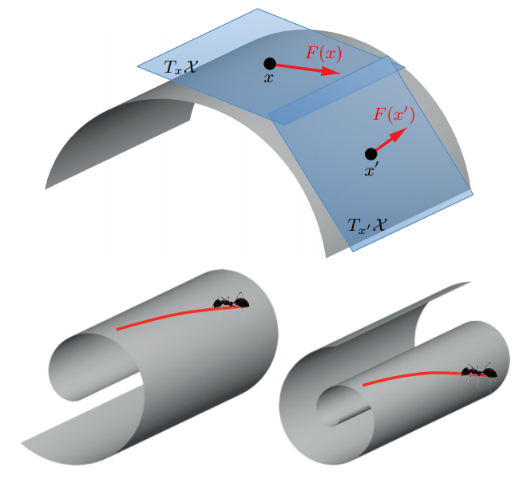

最近读到关于使用Fisher information matrix作为Riemannian metric （黎曼度量）的文章 [2]，对Riemannian metric有些不理解。直到读到这篇文章 [1] 的关于Riemannian manifold的介绍，豁然开朗，记下这篇简短的笔记。

直接上图，来自文章 [1]。

形象地说，我们可以把manifold看成一个光滑的平面，平面上的每一个点上都可以做一个切面。这个切面上是符合欧式空间的定义的，或者说它就是一个平坦的面。比如，在地球上，人在平原上看到的附近的地面都是平坦的，感受不到曲率。

用更加正式的，用数学语言来说，

> 一个（可微的）$d$-维的manifold $\mathcal{X}$ 上，其任意一点$x$附近都等价于$d$-维的欧式空间，这个空间也被称为 tangent space，写作$T_x \mathcal{X}$。

在这个manifold上，所有的这些tangent space组成的集合叫做tangent bundle，写作$T\mathcal{X}$。 

现在，我们可以定义我们的Riemannian metric了。对于一个tangent space，我们可以定义一个内积，比如
$$
\langle \cdot,\cdot \rangle_{T_x \mathcal{X}}:T_x \mathcal{X} \times T_x \mathcal{X} \to \mathbb{R}.
$$
这个内积就是所谓的Riemannian metric。而由这样一个metric定义的manifold则被称为Riemannian manifold。

一个栗子，在 [2] 中定义了一个 Fisher-Rao norm用于度量神经网络的complexity。

> 参数$\theta$ 的Fisher-Rao norm即 $\|\theta\|_{fr}^2 = \langle \theta, I(\theta)\theta \rangle$，这里的 $I(\theta)=\mathbb{E}[\nabla_\theta \ell(f_\theta(X),Y) \ell(f_\theta(X),Y)^{\top}]$ 是模型的Fisher information matrix (FIM)。

这里是把FIM作为了一个模型parameter spaced 的Riemannian metric。这里定义的Fisher-Rao norm可以度量parameter space的flatness，从而量化模型的泛化能力。

### 参考文献

[1] Bronstein, M. M., Bruna, J., LeCun, Y., Szlam, A., & Vandergheynst, P. (2017). Geometric deep learning: going beyond euclidean data. IEEE Signal Processing Magazine, 34(4), 18-42.

[2] Karakida, R., Akaho, S., & Amari, S. I. (2019, April). Universal statistics of Fisher information in deep neural networks: Mean field approach. In *The 22nd International Conference on Artificial Intelligence and Statistics* (pp. 1032-1041). PMLR.

